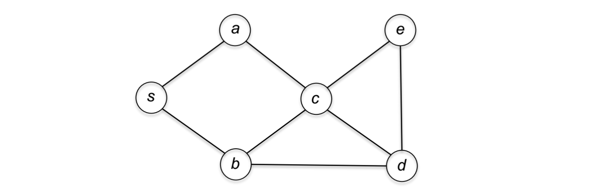

# Depth-First Search

Depth-First Search is an aggressive graphical search strategy that always explores from the most recently discovered vertex and backtracks only when necessary (like expoloring a maze). There are generally two implementations of DFS: *Iterative Implementation* and *Recursive Implementation*:

## Iterative Implementation

The most intuitive implementation would be exploring the graph iteratively using a **Stack** data structure which follows a LIFO pattern that can aggressively expose the most recent explored vertex to the graphical search procedure.

**Input**: graph $G = (V, E)$ in adjacency-list representation, source vertex $s \in V$.
**Postcondition**: a vertex is reachable from source vertex $s$ if and only if it is marked as "explored".

> **Supplementary Note: Postcondition**
> (From Wikipedia), in computer programming, a **postcondition** is a condition or predicate that must always be true after the execution of some section of code or after the operation in a formal specification. Postconditions are sometimes tested using assertions within the code itself.

```pseudocode
PROCEDURE DFS-ITERATIVE(graph: G, source vertex: s)
mark all vertices as unexplored
Initialize a Stack S with source vertex s
while S is not empty do
    v := S.pop()
    if v is unexplored then
        mark v as explored
        for each edge (v, w) in v's adjacency list do
            S.push(w)
END
```

----

As usual, the edges processed in the for-loop are the edges **incident** to $v$ (if $G$ is an undirected graph) or the edges **outgoing** from $v$ (if $G$ is a directed graph).



For example, as shown in the graph above, the first iteration of the while-loop in the DFS procedure would be popping source vertex $s$, marking it as explored and pushing its adjacent vertices $a$ and $b$ onto the stack with arbitrary order, say, b first and a second. In the second iteration, $a$ will be the first vertex to be popped as it was the last vertex to be pushed onto the stack in the last iteration. Then, from the part 5-8 of the pseudocode, the vertex $a$ will be marked as explored while $s$ and $c$ will be pushed onto the stack $S$ in some order, here we assume $c$ first. The vertex $s$ is popped in the following iteration and will be skipped since it’s already explored, then vertex $c$ will be popped, and all its neighbors $a$, $b$, $e$, $d$ will be pushed onto the stack. The procedure cotinues as the DFS has traversed all the vertices in the graph.


## Recursive Implementation

There’s also an elegant implementation of DFS using **recursion**:

----

**Input**: graph $G = (V, E)$ in adjacency-list representation, source vertex $s \in V$.
**Postcondition**: a vertex is reachable from source vertex $s$ if and only if it is marked as "explored".

```pseudocode
PROCEDURE DFS-RECURSIVE(graph: G, source vertex: s)
// All vertices unexplored before outmost call
mark s as explored
for each edge(s, v) in s.adjacency_list do
	if v is unexplored then
		DFS(G,v)
END
```

This implementation makes the aggressive feature of DFS more obvious. In fact, the explicit **Stack** data structure in the iterative implementation of DFS is being simulated by *the program stack of recursive calls* in the recursive implementation. 

>   **Useful Tip**
>
>   When your computer runs out of memory while executing the recursive DFS on a big graph, you should either switch to the iterative version or increase the program stack size in your programming environment.

The recurisve implementation of DFS uses the idea of **Backtracking**, which means that when you are moving forward and there are no more nodes to traverse along the path, you move backwards on the same path to find other nodes to traverse.

## Algorithm Analysis: Correctness and Running Time

Depth-First search is very efficient as a linear-time graphical search algorithm.

**Theorem (Properties of DFS)**: *For every undirected or directed graph $G = (V,E)$ in adjacency-list representation and for every starting vertex $s \in V$:*

-   *At the conclusion of DFS, a vertex $v \in V$ is marked as explored if and only if there is a path from $s$ to $v$ in $G$*.
-   *The running time of DFS is $O(|E| + |V|)$*

The first property holds because in each iteration of a DFS while loop or recursive call, the algorithm chooses the eligible edge $(v, w)$ for which $v$ was discovered most recently. The second property holds because DFS examines each edge at most twice (once from each endpoint) and, because the stack $S$ supports push and pop operations in constant time, and performs a constant number of operations per edge examination ($O(m)$ in total). The initialization requires $O(n)$ time.