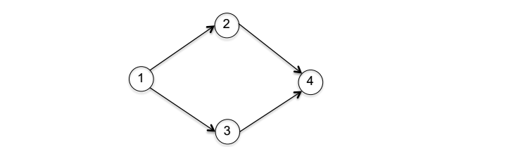
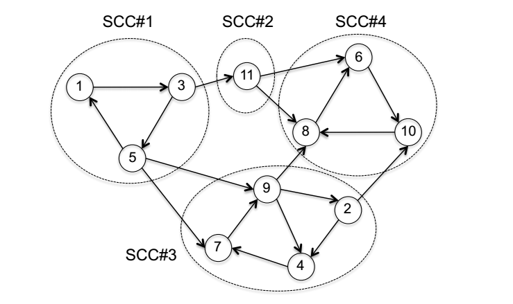

# Strongly Connected Components

## Definition

A *Strongly Connected Component (SCC)* of a **directed** graph is a maximal subset $S \subset V$ of vertices such that there is a directed path from any vertex in $S$ to any other vertex in $S$. As with connected components in undirected graphs, the strongly connected components of a directed graph $G$ are precisely the equivalence classes of an equivalence relation $\sim_G$, where $v \sim_G w$ if and only if there are directed paths from $v$ to $w$ and from $w$ to $v$ in $G$.

> **Supplementary Note: Equivalence Relations**
>
> Equivalence Relations: a *relation* on a set $X$ of objects specifies, for each pair $x, y \in X$, whether or not $x$ and $y$ are related. We denote $x \sim y$ if they are related. For connected components, the relation on vertex set $V$, i.e., $v \sim_G w$ if and only if there is a path between $v$ and $w$ in $G$. An *equivalence* relation then satisfies three properties:
>
> - **Reflexivity**: the relation is *reflexive*, meaning $x \sim x$ for every $x \in X$. (Satisfied by $\sim_G$, as the empty path connects a vertex with itself.)
> - **Symmetrical**: the relation is *symmetric*, with $x \sim y \iff y \sim x$. (Satisfied by $\sim_G$, as within the strongly connected component, it's possible to get from anywhere to anywhere else.)
> - **Transitivity**: the relation is *transitive*, meaning that $x \sim y$ and $y \sim z \implies x \sim z$. (Satisfied by $\sim_G$, since you can paste together a path between vertices $u$ and $v$ with a path between vertices $v$ and $w$ to get a path between $u$ and $w$).
>
> An equivalence relation partitions the set of objects into *equivalence classes*, with each object related to all the objects in its classes, and only to these. For a directed graph $G$, the equivalent classes of the relation $\sim_G$ are the *Strongly Connected Components* of $G$.

### Proposition 1 (The SCC Meta-Graph Is Directed Acyclic)

*Let $G = (V,E)$ be a directed graph. Define the corresponding meta-graph $H = (X, F)$ with one meta-vertex $x \in X$ per SCC of $G$ and a meta-edge $(x, y)$ in $F$ whenever there is an edge in $G$ from a vertex in one SCC corresponding to $x$ to one in another SCC corresponding to $y$. Then $H$ is a directed acyclic graph.*

​                                                                                       **Figure 1**

​                                                                                     **Figure 2**

For example, the directed acyclic graph in **Figure 1** is the meta-graph corresponding to the directed graph in **Figure 2**.

*Proof*

If the meta-graph $H$ had a directed cycle with $k \geq 2$ vertices, then the corresponding cycle of allegedly distinct SCCs $S_1, S_2, \cdots, S_k$ in $G$ would finally collapse to a single SCC since you can already travel freely within each $S_i$, the cycle connecting these $S_i$'s will make travel possible between any pair of the $S_i$'s. $\blacksquare$

>   **NOTE**
>
>   This proposition implies that every directed graph can be viewed at two levels of granularity in terms of Strongly Connected Components. Zooming out, you have the acyclic relationships among the SCCs; zooming in, you have fine-grained structures in individual SCCs.

## Kosaraju’s Algorithm

The key take away here is that the graph search (breadth-first or depth-first search) can uncover strongly connected components given you start from the right place.

